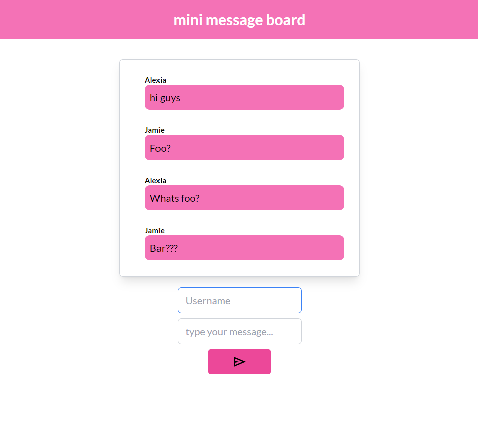

# Mini Message Board

Mini Message Board is a simple chat application built using the MERN (MongoDB, Express.js, React.js, Node.js) stack and Socket.IO for real-time communication.



## Features

- Real-time messaging: Messages are delivered instantly to all connected clients.
- Infinite scroll: Chat history is loaded dynamically as the user scrolls up.

## How to Run

### Prerequisites

- Node.js and npm installed on your machine

### Steps

1. Clone the repository
2. Navigate to the project directory
3. Install dependencies for both the client and server:

```bash
cd clientside
npm install
```

```bash
cd ../serverside
npm install
```

4. Start the server:

```bash
cd ../serverside
npm start
```

5. Start the client:

```bash
cd ../clientside
npm start
```

6. Open your web browser and navigate to http://localhost:5173 to view the application.
